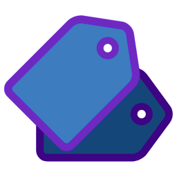

  
  <h1 align="center">Code Tags</h1>
  <h4 align="center">Add tags to your code with predefined templates</h4>
   

## Features

Provides templates for the following code tags...

* **TODO:** (MILESTONE, MLSTN, DONE, YAGNI, TBD, TOBEDONE)   **To do**:Informal tasks/features that are pending completion.

* **FIXME:** (XXX, DEBUG, BROKEN, REFACTOR, REFACT, RFCTR, OOPS, SMELL, NEEDSWORK, INSPECT)   **Fix me**: Areas of problematic or ugly code needing refactoring or cleanup.

* **BUG:** (BUGFIX)   **Bugs**: Reported defects tracked in bug database.

* **IDEA:**   **Ideas**: Possible RFE candidates, but less formal than RFE.

* **WTF:** (WTF, QUEST, QSTN, QUESTION)  
**Questions**: Misunderstood details.

* **HACK:** (CLEVER, MAGIC)   **Hacks**: Temporary code to force inflexible functionality, or simply a test change, or workaround a known problem.

* **NOTE:** (HELP)   **Notes**: Sections where a code reviewer found something that needs discussion or further investigation.

* **SEE:** (REF, REFERENCE)   **See**: Pointers to other code, web link, etc.

### tags which can be further added...

* **NOBUG:** (NOFIX, WONTFIX, DONTFIX, NEVERFIX, UNFIXABLE, CANTFIX)   **Will Not Be Fixed**: Problems that are well-known but will never be addressed due to design problems or domain limitations.

* **REQ:** (REQUIREMENT, STORY)   **Requirements**: Satisfactions of specific, formal requirements.

* **RFE:** (FEETCH, NYI, FR, FTRQ, FTR)   **Requests For Enhancement**: Roadmap items not yet implemented.

* **!!!:** (ALERT)  
**Alerts**: In need of immediate attention.

* **PORT:** (PORTABILITY, WKRD)   **Portability**: Workarounds specific to OS, language version, etc.

* **CAVEAT:** (CAV, CAVT, WARNING, CAUTION)   **Caveats**: Implementation details/gotchas that stand out as non-intuitive.

* **FAQ:**   **Frequently Asked Questions**: Interesting areas that require external explanation.

* **GLOSS:** (GLOSSARY)   **Glossary**: Definitions for project glossary.

* **TODOC:** (DOCDO, DODOC, NEEDSDOC, EXPLAIN, DOCUMENT)   **Needs Documentation**: Areas of code that still need to be documented.

* **CRED:** (CREDIT, THANKS)   **Credits**: Accreditations for external provision of enlightenment.

* **STAT:** (STATUS)   **Status**: File-level statistical indicator of maturity of this file.

* **RVD:** (REVIEWED, REVIEW)   **Reviewed**: File-level indicator that review was conducted.

## Inspiration:

* [Never forget anything before after and while coding](https://hackernoon.com/never-forget-anything-before-after-and-while-coding-98d187ae4cf1), a medium article by [Eido Askayo](https://mediu.com/eido.askayo).
* [PEP 350 -- Codetags](https://www.python.org/dev/peps/pep-0350/) by Micah Elliott.

### Issue/Feedback:

log them in the [github issues](https://github.com/cg-cnu/vscode-codetags/issues) or hit me on [twitter](https://twitter.com/CgCnu).

### Like it?:

:star: this repo.